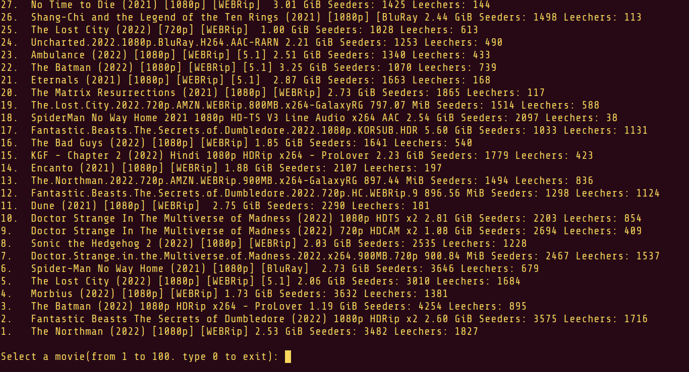
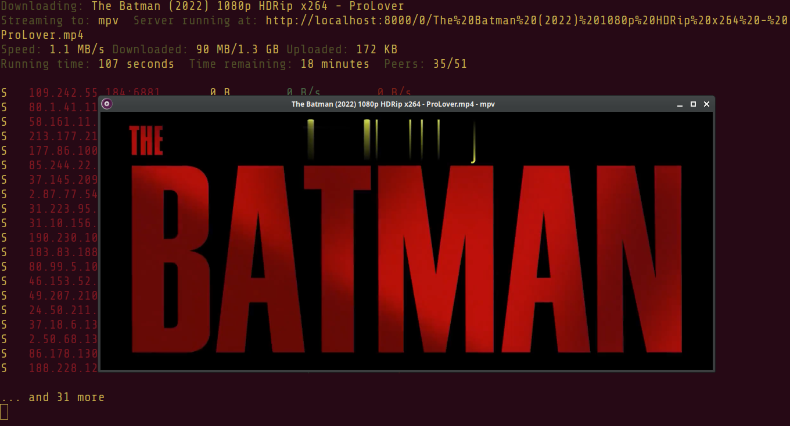

<h2 align='center'>Basedflix</h2>
<p align='center'><i>"Stream any movie in seconds. Either search for a movie or select from the current top 100 movies from The Pirate Bay!"</i></p>

<div align='center'>


</div>

## Contributors

<div align='center'>
<a href="https://github.com/northoc/cliflix/graphs/contributors">
  
</a>
</div>

## Dependencies:

Everything is installed via `install.sh`, but if you need it for manual installation

1. python3 python3-dev python3-pip npm

2. npm and nodejs:

3. webtorrent-cli

```bash
sudo npm install webtorrent-cli -g
```

## Quick install

<i>"Requirements: the apt package manager"</i>

<i>"Current Issue: Jammy Jellyfish cannot install npm via the apt package manager due to a required out-of-date dependency"</i>

```bash
git clone https://github.com/NorthOC/basedflix
cd basedflix
./install.sh
```
What this will do is simple:
1. Install dependencies (using apt)
1. Create a virtual Python environment `venv`
2. Install from `requirements.txt` to the virtual environment
3. Create a symlink `/usr/local/bin/basedflix`

That is it! You can launch the program now by typing `basedflix` in your terminal.

In case of manual installation, you can use these steps as a reference. To install npm, use a node version manager like [nvm](https://github.com/nvm-sh/nvm)


## Important Note

*Use a vpn if your country has very strict laws on torrenting!*

## Supported Video players

| Player (CLI command) | Player name | Install via apt package manager |
|----------------------|-------------|---------------------------------|
| airplay              | Apple TV    |                                 |
| chromecast           | Chromecast  |                                 |
| dlna                 | DLNA        |                                 |
| mplayer              | mplayer     | `sudo apt install mplayer`      |
| mpv                  | MPV         | `sudo apt install mpv`          |
| omx                  | OMX         |                                 |
| vlc                  | VLC         | `sudo apt install vlc`          |
| iina                 | IINA        |                                 |
| smplayer             | SMPlayer    | `sudo apt install smplayer`     |
| xbmc                 | XBMC        |                                 |

## Subtitles

Sometimes the movie comes with subtitles. However, if there are no subtitles, you can find some on the web and upload the .srt file to the media player.

## Screenshots





## How it works

The JSON data is received from thepiratebay API. It is then parsed into an easily manageable array. Then the movies are displayed to the console. After that you select the movie and a supported media player. The webtorrent-cli then receives a magnet link and streams the torrent, on a chosen video player.

## Roadmap

- Create JSON parser (done)
- Create Streamer (done)
- Watch top 100 movies (done)
- Install script (done)
- Minimum viable product (done)
- Simplify Install script (done)
- Video demo
- Uninstall script (done)
- Watch any movie (done)
- GUI (done)
- TODO: Update install script
